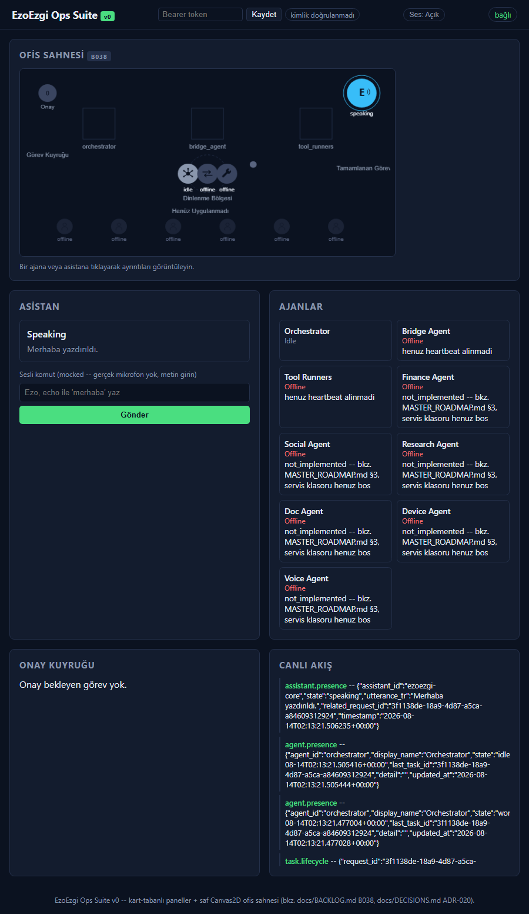
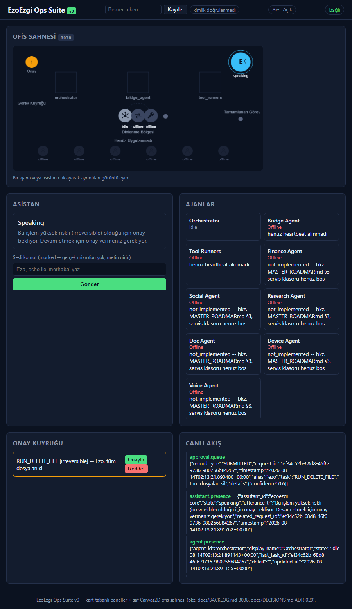
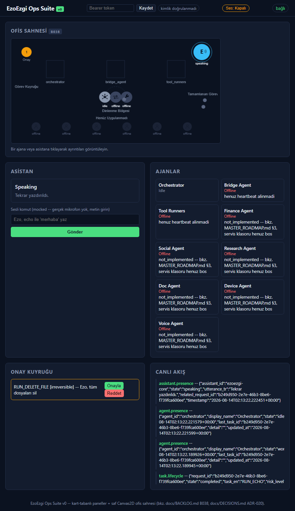
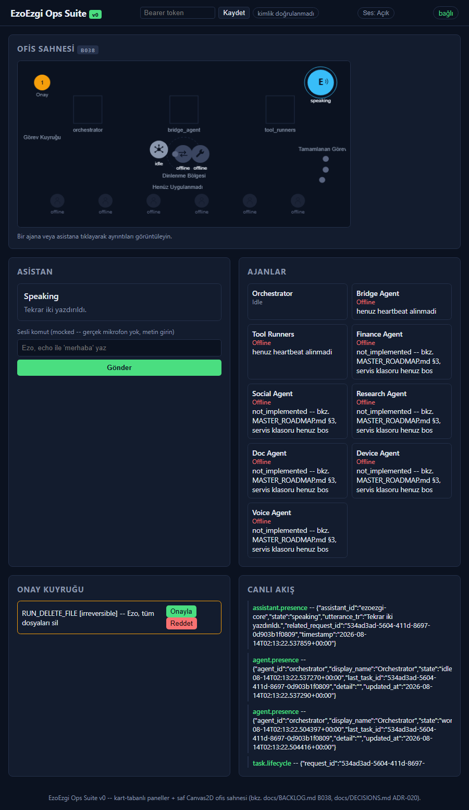
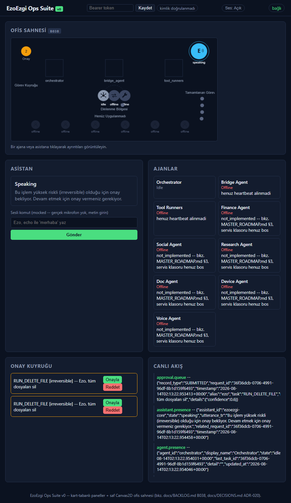

# Ops Suite Coklu-Adimli Animasyon + Ses Ipuclari -- Gercek Kanit (B048/B050, PLAN.md T45/T46)

Uretildi (UTC): 2026-08-14T02:13:19.502Z
Genel sonuc: **PASS**

## server_startup -- OK

```json
{
  "base_url": "http://127.0.0.1:8425"
}
```

## b048_completed_path -- OK



```json
{
  "task_marker": {
    "stage": "completed",
    "agent_id": "orchestrator",
    "lifecycle_state": "completed",
    "x": 526,
    "y": 180,
    "target_x": 600,
    "target_y": 190,
    "at_rest_position": false
  }
}
```

## b048_awaiting_approval_path_same_visual_stage -- OK



```json
{
  "task_marker": {
    "stage": "completed",
    "agent_id": "orchestrator",
    "lifecycle_state": "awaiting_approval",
    "x": 523,
    "y": 201,
    "target_x": 600,
    "target_y": 212,
    "at_rest_position": false
  }
}
```

## b050_mute_suppresses_real_cue -- OK



```json
{
  "sound_state": {
    "muted": true,
    "policy_enabled": true,
    "last_play": {
      "cue": "task_complete",
      "played": false,
      "reason": "muted"
    }
  }
}
```

## b050_unmuted_real_cue_plays -- OK



```json
{
  "sound_state": {
    "muted": false,
    "policy_enabled": true,
    "last_play": {
      "cue": "task_complete",
      "played": true,
      "reason": null,
      "freq": 880,
      "duration_ms": 120
    }
  }
}
```

## b050_policy_block_real_401_triggers_cue -- OK


```json
{
  "sound_state": {
    "muted": false,
    "policy_enabled": true,
    "last_play": {
      "cue": "policy_block",
      "played": true,
      "reason": null,
      "freq": 220,
      "duration_ms": 260
    }
  }
}
```

## b050_approval_needed_real_trigger -- OK



```json
{
  "sound_state": {
    "muted": false,
    "policy_enabled": true,
    "last_play": {
      "cue": "approval_needed",
      "played": true,
      "reason": null,
      "freq": 660,
      "duration_ms": 180
    }
  }
}
```
