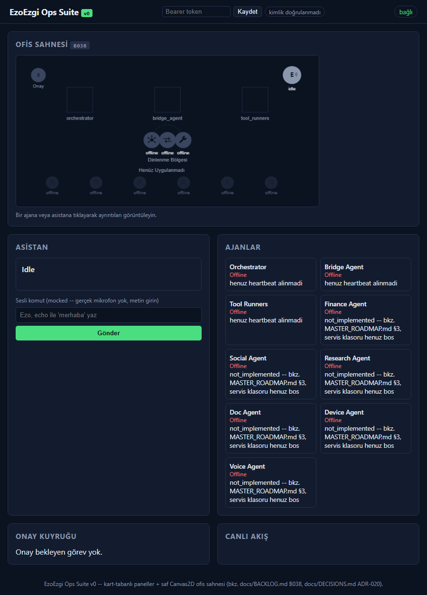
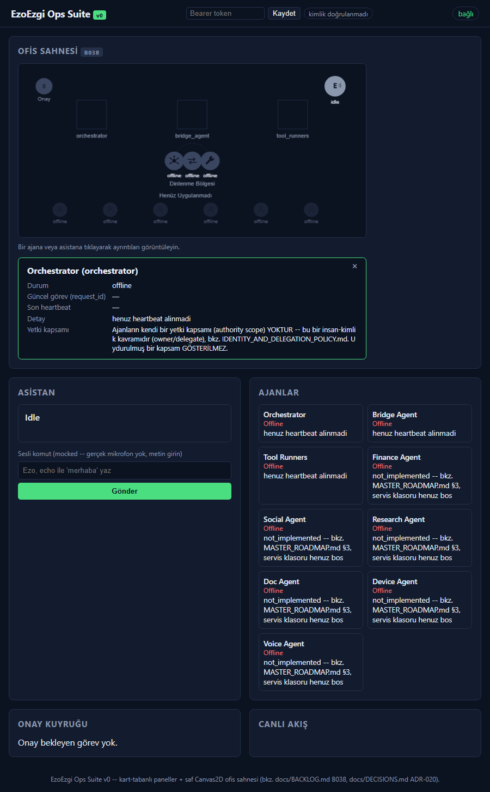
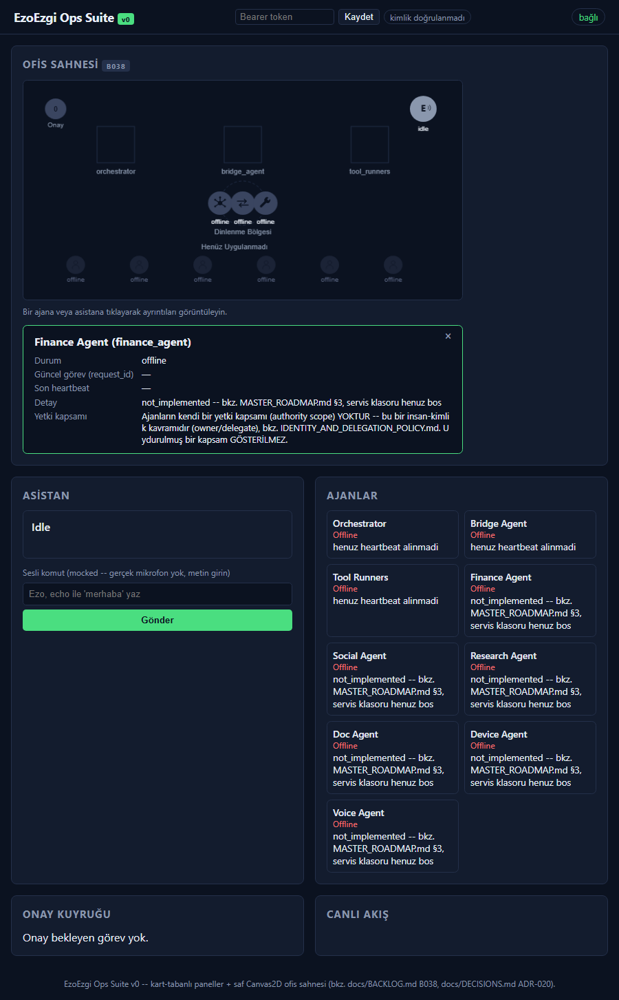
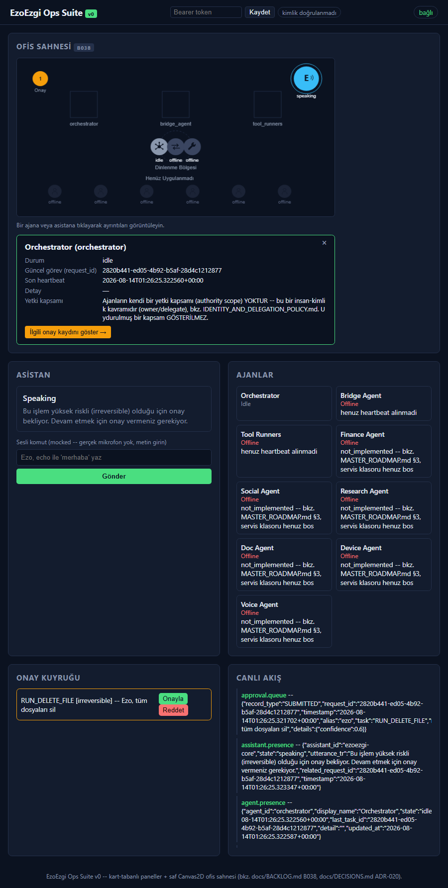

# Ops Suite Sprite + Tiklama Etkilesimleri -- Gercek Kanit (B047/B049, PLAN.md T40/T42)

Uretildi (UTC): 2026-08-14T01:26:22.416Z
Genel sonuc: **PASS**

## server_startup -- OK

```json
{
  "base_url": "http://127.0.0.1:8424"
}
```

## b047_sprites_loaded -- OK



```json
{
  "debug_state": {
    "assistant_state": "idle",
    "pending_approval_count": 0,
    "agents": {
      "orchestrator": {
        "state": "offline",
        "zone": "rest",
        "x": 286,
        "y": 180,
        "target_x": 286,
        "target_y": 180,
        "at_rest_position": true
      },
      "bridge_agent": {
        "state": "offline",
        "zone": "rest",
        "x": 320,
        "y": 180,
        "target_x": 320,
        "target_y": 180,
        "at_rest_position": true
      },
      "tool_runners": {
        "state": "offline",
        "zone": "rest",
        "x": 354,
        "y": 180,
        "target_x": 354,
        "target_y": 180,
        "at_rest_position": true
      },
      "finance_agent": {
        "state": "offline",
        "zone": "ghost",
        "x": 70,
        "y": 275,
        "target_x": 70,
        "target_y": 275,
        "at_rest_position": true
      },
      "social_agent": {
        "state": "offline",
        "zone": "ghost",
        "x": 165,
        "y": 275,
        "target_x": 165,
        "target_y": 275,
        "at_rest_position": true
      },
      "research_agent": {
        "state": "offline",
        "zone": "ghost",
        "x": 260,
        "y": 275,
        "target_x": 260,
        "target_y": 275,
        "at_rest_position": true
      },
      "doc_agent": {
        "state": "offline",
        "zone": "ghost",
        "x": 355,
        "y": 275,
        "target_x": 355,
        "target_y": 275,
        "at_rest_position": true
      },
      "device_agent": {
        "state": "offline",
        "zone": "ghost",
        "x": 450,
        "y": 275,
        "target_x": 450,
        "target_y": 275,
        "at_rest_position": true
      },
      "voice_agent": {
        "state": "offline",
        "zone": "ghost",
        "x": 545,
        "y": 275,
        "target_x": 545,
        "target_y": 275,
        "at_rest_position": true
      }
    },
    "sprites": {
      "assistant": "loaded",
      "ghost": "loaded",
      "orchestrator": "loaded",
      "bridge_agent": "loaded",
      "tool_runners": "loaded"
    }
  }
}
```

## b049_agent_click_opens_panel -- OK



```json
{
  "panel_name": "Orchestrator (orchestrator)"
}
```

## b049_ghost_agent_click_shows_honest_detail -- OK



```json
{
  "detail_text": "not_implemented -- bkz. MASTER_ROADMAP.md §3, servis klasoru henuz bos"
}
```

## b049_pending_approval_link_shown -- OK



```json
{
  "request_id": "2820b441-ed05-4b92-b5af-28d4c1212877",
  "task_field": "2820b441-ed05-4b92-b5af-28d4c1212877"
}
```

## b049_approval_link_click_highlights_item -- OK


```json
{}
```
