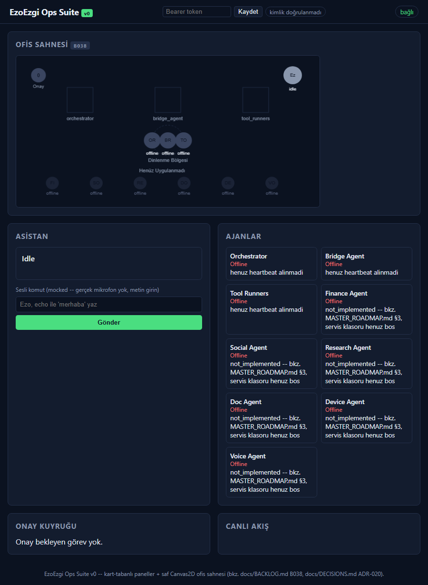
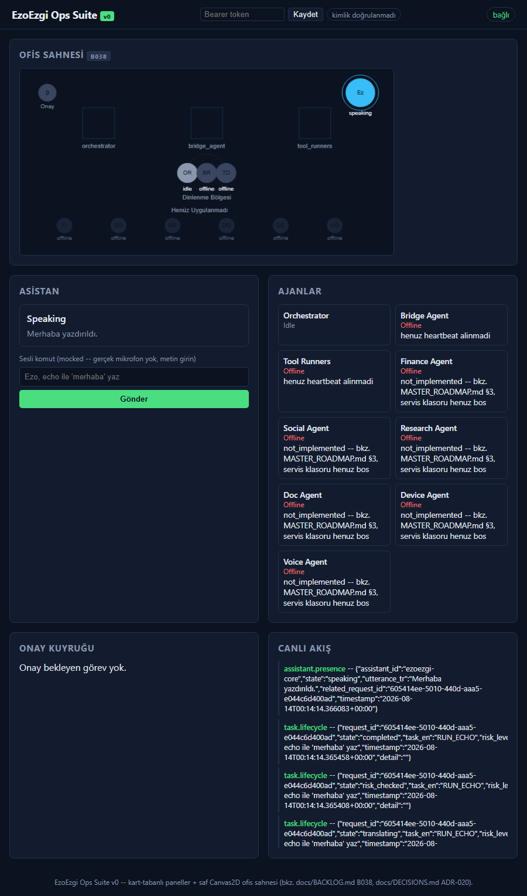
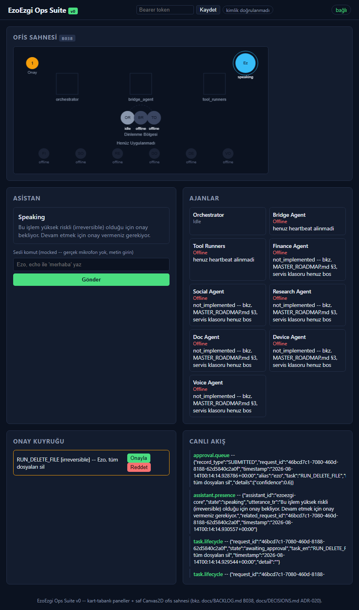
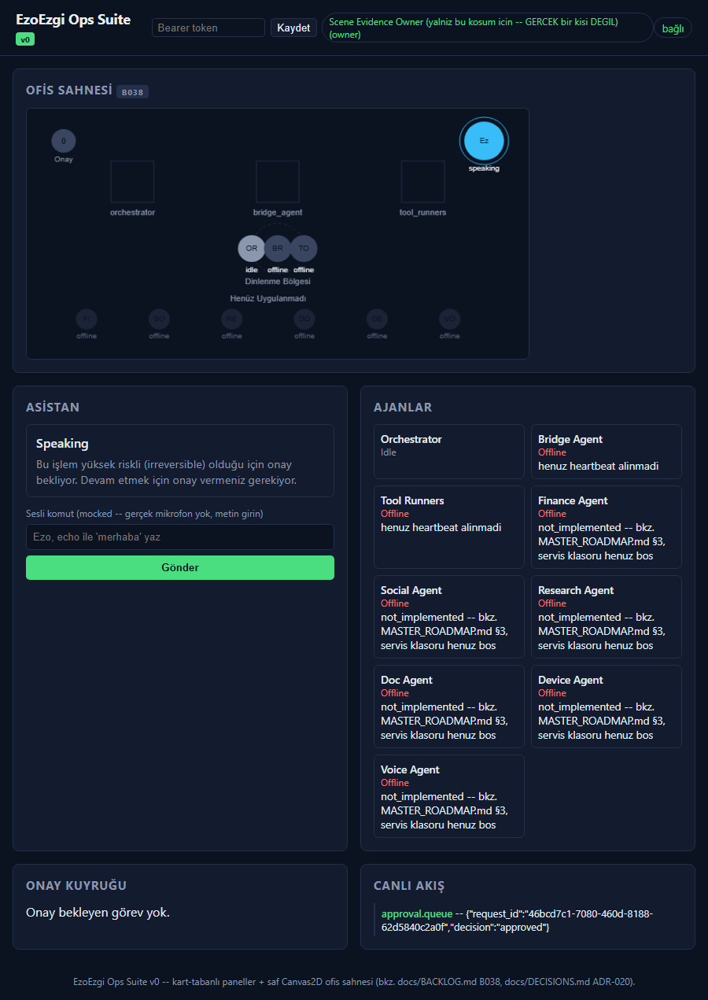

# Ops Suite Ofis Sahnesi -- Gerçek Kanıt (B038, PLAN.md T36)

Üretildi (UTC): 2026-08-14T00:14:12.082Z
base_url: http://127.0.0.1:8422
Genel sonuç: **PASS**

## server_startup -- OK

## transition_1_initial_state -- OK



```json
{
  "assistant_state": "idle",
  "pending_approval_count": 0,
  "agents": {
    "orchestrator": {
      "state": "offline",
      "zone": "rest",
      "x": 286,
      "y": 180,
      "target_x": 286,
      "target_y": 180,
      "at_rest_position": true
    },
    "bridge_agent": {
      "state": "offline",
      "zone": "rest",
      "x": 320,
      "y": 180,
      "target_x": 320,
      "target_y": 180,
      "at_rest_position": true
    },
    "tool_runners": {
      "state": "offline",
      "zone": "rest",
      "x": 354,
      "y": 180,
      "target_x": 354,
      "target_y": 180,
      "at_rest_position": true
    },
    "finance_agent": {
      "state": "offline",
      "zone": "ghost",
      "x": 70,
      "y": 275,
      "target_x": 70,
      "target_y": 275,
      "at_rest_position": true
    },
    "social_agent": {
      "state": "offline",
      "zone": "ghost",
      "x": 165,
      "y": 275,
      "target_x": 165,
      "target_y": 275,
      "at_rest_position": true
    },
    "research_agent": {
      "state": "offline",
      "zone": "ghost",
      "x": 260,
      "y": 275,
      "target_x": 260,
      "target_y": 275,
      "at_rest_position": true
    },
    "doc_agent": {
      "state": "offline",
      "zone": "ghost",
      "x": 355,
      "y": 275,
      "target_x": 355,
      "target_y": 275,
      "at_rest_position": true
    },
    "device_agent": {
      "state": "offline",
      "zone": "ghost",
      "x": 450,
      "y": 275,
      "target_x": 450,
      "target_y": 275,
      "at_rest_position": true
    },
    "voice_agent": {
      "state": "offline",
      "zone": "ghost",
      "x": 545,
      "y": 275,
      "target_x": 545,
      "target_y": 275,
      "at_rest_position": true
    }
  }
}
```

## transition_2_echo_command -- OK



```json
{
  "assistant_state": "speaking",
  "pending_approval_count": 0,
  "agents": {
    "orchestrator": {
      "state": "idle",
      "zone": "rest",
      "x": 286,
      "y": 180,
      "target_x": 286,
      "target_y": 180,
      "at_rest_position": true
    },
    "bridge_agent": {
      "state": "offline",
      "zone": "rest",
      "x": 320,
      "y": 180,
      "target_x": 320,
      "target_y": 180,
      "at_rest_position": true
    },
    "tool_runners": {
      "state": "offline",
      "zone": "rest",
      "x": 354,
      "y": 180,
      "target_x": 354,
      "target_y": 180,
      "at_rest_position": true
    },
    "finance_agent": {
      "state": "offline",
      "zone": "ghost",
      "x": 70,
      "y": 275,
      "target_x": 70,
      "target_y": 275,
      "at_rest_position": true
    },
    "social_agent": {
      "state": "offline",
      "zone": "ghost",
      "x": 165,
      "y": 275,
      "target_x": 165,
      "target_y": 275,
      "at_rest_position": true
    },
    "research_agent": {
      "state": "offline",
      "zone": "ghost",
      "x": 260,
      "y": 275,
      "target_x": 260,
      "target_y": 275,
      "at_rest_position": true
    },
    "doc_agent": {
      "state": "offline",
      "zone": "ghost",
      "x": 355,
      "y": 275,
      "target_x": 355,
      "target_y": 275,
      "at_rest_position": true
    },
    "device_agent": {
      "state": "offline",
      "zone": "ghost",
      "x": 450,
      "y": 275,
      "target_x": 450,
      "target_y": 275,
      "at_rest_position": true
    },
    "voice_agent": {
      "state": "offline",
      "zone": "ghost",
      "x": 545,
      "y": 275,
      "target_x": 545,
      "target_y": 275,
      "at_rest_position": true
    }
  }
}
```

## transition_3a_pending_approval -- OK



```json
{
  "assistant_state": "speaking",
  "pending_approval_count": 1,
  "agents": {
    "orchestrator": {
      "state": "idle",
      "zone": "rest",
      "x": 286,
      "y": 180,
      "target_x": 286,
      "target_y": 180,
      "at_rest_position": true
    },
    "bridge_agent": {
      "state": "offline",
      "zone": "rest",
      "x": 320,
      "y": 180,
      "target_x": 320,
      "target_y": 180,
      "at_rest_position": true
    },
    "tool_runners": {
      "state": "offline",
      "zone": "rest",
      "x": 354,
      "y": 180,
      "target_x": 354,
      "target_y": 180,
      "at_rest_position": true
    },
    "finance_agent": {
      "state": "offline",
      "zone": "ghost",
      "x": 70,
      "y": 275,
      "target_x": 70,
      "target_y": 275,
      "at_rest_position": true
    },
    "social_agent": {
      "state": "offline",
      "zone": "ghost",
      "x": 165,
      "y": 275,
      "target_x": 165,
      "target_y": 275,
      "at_rest_position": true
    },
    "research_agent": {
      "state": "offline",
      "zone": "ghost",
      "x": 260,
      "y": 275,
      "target_x": 260,
      "target_y": 275,
      "at_rest_position": true
    },
    "doc_agent": {
      "state": "offline",
      "zone": "ghost",
      "x": 355,
      "y": 275,
      "target_x": 355,
      "target_y": 275,
      "at_rest_position": true
    },
    "device_agent": {
      "state": "offline",
      "zone": "ghost",
      "x": 450,
      "y": 275,
      "target_x": 450,
      "target_y": 275,
      "at_rest_position": true
    },
    "voice_agent": {
      "state": "offline",
      "zone": "ghost",
      "x": 545,
      "y": 275,
      "target_x": 545,
      "target_y": 275,
      "at_rest_position": true
    }
  }
}
```

## transition_3b_owner_approved -- OK



```json
{
  "assistant_state": "speaking",
  "pending_approval_count": 0,
  "agents": {
    "orchestrator": {
      "state": "idle",
      "zone": "rest",
      "x": 286,
      "y": 180,
      "target_x": 286,
      "target_y": 180,
      "at_rest_position": true
    },
    "bridge_agent": {
      "state": "offline",
      "zone": "rest",
      "x": 320,
      "y": 180,
      "target_x": 320,
      "target_y": 180,
      "at_rest_position": true
    },
    "tool_runners": {
      "state": "offline",
      "zone": "rest",
      "x": 354,
      "y": 180,
      "target_x": 354,
      "target_y": 180,
      "at_rest_position": true
    },
    "finance_agent": {
      "state": "offline",
      "zone": "ghost",
      "x": 70,
      "y": 275,
      "target_x": 70,
      "target_y": 275,
      "at_rest_position": true
    },
    "social_agent": {
      "state": "offline",
      "zone": "ghost",
      "x": 165,
      "y": 275,
      "target_x": 165,
      "target_y": 275,
      "at_rest_position": true
    },
    "research_agent": {
      "state": "offline",
      "zone": "ghost",
      "x": 260,
      "y": 275,
      "target_x": 260,
      "target_y": 275,
      "at_rest_position": true
    },
    "doc_agent": {
      "state": "offline",
      "zone": "ghost",
      "x": 355,
      "y": 275,
      "target_x": 355,
      "target_y": 275,
      "at_rest_position": true
    },
    "device_agent": {
      "state": "offline",
      "zone": "ghost",
      "x": 450,
      "y": 275,
      "target_x": 450,
      "target_y": 275,
      "at_rest_position": true
    },
    "voice_agent": {
      "state": "offline",
      "zone": "ghost",
      "x": 545,
      "y": 275,
      "target_x": 545,
      "target_y": 275,
      "at_rest_position": true
    }
  }
}
```
